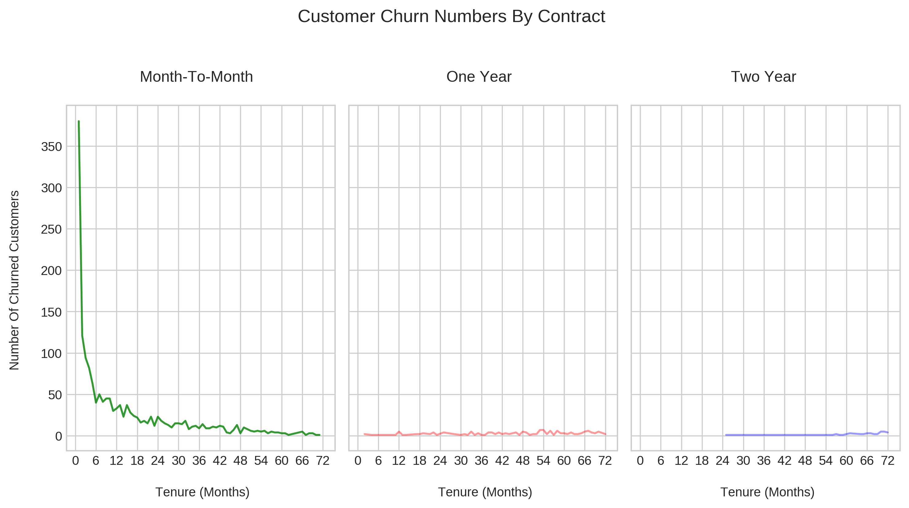
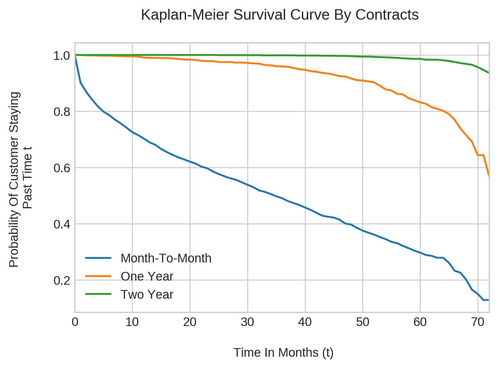

# Unit 2 - Classification Project

This README.md file provides an overview on machine learning classification project that was done for
a school program.

&nbsp;

---

# Contents

* Project Brief
* Dataset Information
* My Data Analysis Strategy
* Number Of Churns By Contract (Image)
* Survival Analysis Kaplan-Meier Usage & Insights
* Decision Tree Model
* K-Nearest Neighbours Model
* Logistic Regression Model
* Recommendations For Reducing Customer Churn

&nbsp;

---

# Project Brief

Given a telecomunnications dataset, the company would like to know which
customers are likely to leave (churn). A plan also needs to be developed
in an attempt to keep customers from leaving/churning.

* Presentation and analyses is for a (hypothetical) marketing and operations team.

* Telco profits are mostly from cellular plans and overage fees.

* In a competitive telco market, customers can easily switch service providers as they may think the grass is greener on the other side. A loyal customer helps with maintaining cash flows and gaining market share on its competition.

* Data plans not known.

* Telco company is based in the USA.

&nbsp;

---

# Dataset Information

* 7043 customers in the dataset for US Telcom. Business.
* Two services : Phone, Internet (DSL / Fiber Optic).
* Contract Plans: Month-To-Month, One Year, Two Year 
* Variables Of Interest: MonthlyCharges, Tenure (Time In Months), Contract.

&nbsp;

---

# My Data Analysis Strategy

I wanted to explore different classifcation models for customer churn. Three classification models were explored in the notebook.

* K-Nearest Neighbours
* Decision Trees
* Logistic Regression (Ridge, LASSO, ElasticNet)

On top of this, I wanted to experiment with Kaplan-Meier survival analysis curves to compare contract groups and their churns.

&nbsp;

## Number Of Churns By Contract (Image)

As a part of the initial exploratory data analysis, the image below shows the number of churns by contract.

&nbsp;

## Survival Analysis Kaplan-Meier Usage & Insights

Survival analysis Kaplan Meier Curves were included to showcase the difference in contract plan groups and their churns. The event of interest is Churn and the time is the customer tenure time.

The probability of a month-to-month customer staying with the telco company is lower versus those who are in one-year or two-year plans.
This is clearly shown from the image below.

&nbsp;

&nbsp;

# Decision Tree Model

## Decison Tree Model & Scores

The main features used in the Decision Tree are MonthlyCharges, is_monthly (0= F, 1 = T) and Tenure. Grid Search was used for selecting a final model with F1-Score metric.

Metric | Metric Score
------------ | -------------
Train F1-Score | 0.609
Validation Set F1-Score | 0.628

&nbsp;

## Decision Tree Insights

From 7043 customers in the dataset:

* 340 churns from not month-to-month customers
* 393 churns where the customer was month-to-month, paying < $68/mth with customer tenure months < 3.5.
* 1747 churns from month-to-month & paying more than $68/mth

&nbsp;
---

# K-Nearest Neighbours

K-Nearest Neighbours was experimented with as a classifier model but was not showcased in the main presentation slides. KNN models were not considered as the models were biased to points near the test data points.

Two KNN models were selected with a grid search with one grid search for recall and the other for f1-score. Features of interest were MonthlyCharges, tenure (Months), is_monthly.

&nbsp;
---

# Logistic Regression Model Insights

* Ridge Regression penalty used for final model with liblinear and C = 0.01
* tenure coefficient is -0.74: As the customer stays longer there are less likely to churn.
* MonthlyCharges coefficient is 0.735: Higher monthly charges can lead to churn.
* is_monthly coefficient is 0.654: If the customer is on a monthly plan they are more likely to churn.

---

# Recommendations For Reducing Customer Churn

* Many churns are from month to month customers with tenure times at most at 6 months.
* Can offer one or two year promo plans to existing mth-mth customers during customer’s 5th month. (E-Mail)
* Suugest a promo offer for customers to sign up for one/two year plans one month from end of one/two year contract. 
* Look at month-to-month and > $68 / mth. cases more closely. (1747 Churns)
* Look into internals such as customer service, signal service, competitor pricing.

